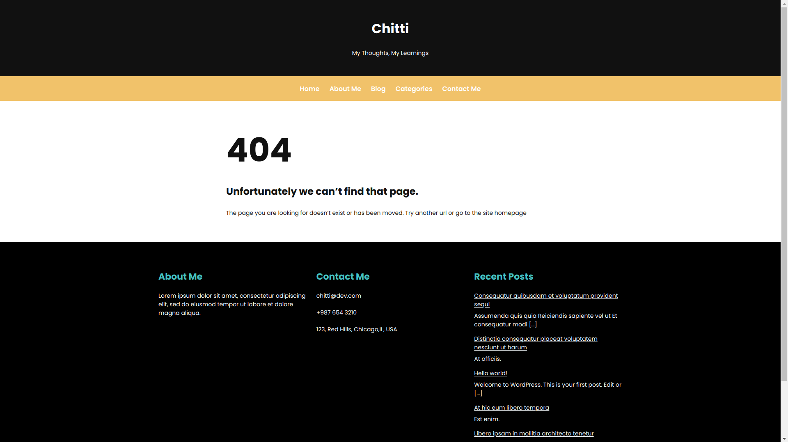

# Dev Talks


Dev Talks Theme is a WordPress Full Site Editing (FSE) theme. It is built with flexibility in mind, allowing you to easily customize various aspects of the theme to fit your needs.

View samples - [Here](https://github.com/i-am-chitti/wp-fse-demo/tree/main/themes/dev-talks/screenshots)

Demo Link - [Here](https://deepak-dev.rt.gw)

## Installation
1. Download this as zip
2. In your WordPress dashboard, navigate to Appearance > Themes.
3. Click on the "Add New" button.
4. Click on the "Upload Theme" button.
5. Choose the zip file you downloaded in step 1.
6. Click the "Install Now" button.
7. Once the theme is installed, click the "Activate" button to activate it.
8. Create two pages and set one as homepage and other as front page from `Reading` sub-page of `Settings` page in WordPress Dashboard.

## Features

Dev Talks Theme comes with a range of features to help you build a modern, user-friendly website:

- Full Site Editing (FSE) support: Dev Talks Theme is designed to work with WordPress Full Site Editing (FSE), allowing you to customize your entire website using the block editor.
- Customizable header and footer: You can easily customize the header and footer of your website using the block editor.
- Customizable homepage: Dev Talks Theme comes with a customizable homepage template that allows you to showcase your services, recent blog posts, and more.
- Customizable blog page: The theme comes with a customizable blog page template that allows you to display your blog posts in a clean, modern layout.
- Responsive design: Dev Talks Theme is designed to be fully responsive, ensuring that your website looks great on all devices.

### Blocks

1. **Structured FAQ** - A FAQ block that render content in the [SEO structured data](https://developers.google.com/search/docs/appearance/structured-data/faqpage). If you're new to structured data, you can learn more about how [structured data works](https://developers.google.com/search/docs/appearance/structured-data/intro-structured-data). This block extends the existing heading core block to inject the SEO data. This is done by adding extra props on the inner core blocks.
  

2. **Recipe Card** - A two column recipe card to display recipe title, ingredients, instructions and the dish image.
  

### Block Variation

1. **Group Shadow Variation** - Use group core block with a solid shadow.
  

2. **Media and text variation** - Made a variation of media and text to allow heading, and any other type of block to be put inside the text content instead of having a plain text content.
  

### Block Extension

1. **Responsiveness** - Gutenberg offers the padding, margin spacing but they are limited to be applied on all devices. What if we want to have padding, margin, text alignment to selective based on screen type. So, the default blocks are extended to offer responsive controls. User can play around them to offer dynamic spacing, alignment, typography, etc. 

## Templates

1. **404** - [Here](https://deepak-dev.rt.gw/not-found)
  

2. **Archive** - [Here](https://deepak-dev.rt.gw/blog/)
  

3. **Front Page** -[Here](https://deepak-dev.rt.gw/)
  

4. **Page** - [Here](https://deepak-dev.rt.gw/about-me)
  

5. **Search** - [Here](https://deepak-dev.rt.gw?s=he)
  

6. **Single** - [Here](https://deepak-dev.rt.gw/blog/2023/04/12/javascript/)
  
## Understand the Folder Structure :open_file_folder:
```
 .
├── assets (Holds theme's assets)
│   └── src
│       └── js
│       └── css
├── bin (Holds scripts)
├── functions.php (PHP entry point)
├── inc
│   ├── classes (Holds all classes)
│   │   └── class-dev-talks.php (Instantiates all of the classes)
│   ├── helpers (PHP Helpers)
│   │   └── custom-functions.php
│   └── traits (PHP Traits)
│       └── trait-singleton.php
├── index.php
├── parts (Block Template Parts)
├── patterns (Block Patterns)
│   ├── *.html
├── style.css
├── templates (Block Templates)
│   ├── *.html
├── tests (Holds JS & PHP tests)
│   ├── bootstrap.php
│   ├── js
│   └── php
└── theme.json

```

## Development :computer:


**Production**

```bash
npm run build:prod
```

**Watch changes**

```bash
npm start
```

**Linting & Formatting**

Lint JS, CSS & PHP.
```bash
npm run lint:js
npm run lint:css
npm run lint:php #phpcs
```

Auto fix fixable linting errors for JS, CSS & PHP.

```bash
npm run lint:js:fix
npm run lint:css:fix
npm run lint:php:fix #phpcbf
```

**Testing**

Run all tests.

```bash
pnpm run test
```

Run JS tests.

```bash
pnpm run test:js
```

Watch JS tests.

```bash
pnpm run test:js:watch
```

Run PHP tests.

```bash
pnpm run test:php
```

## Support
If you need help with Dev Talks Theme, please reach out to our support team at deepak.kumar852182@gmail.com. We are always happy to help with any questions or issues you may have.

## License
Dev Talks Theme is released under the GPLv2 or later license. You are free to use, modify, and distribute the theme as long as you follow the terms of the license.
